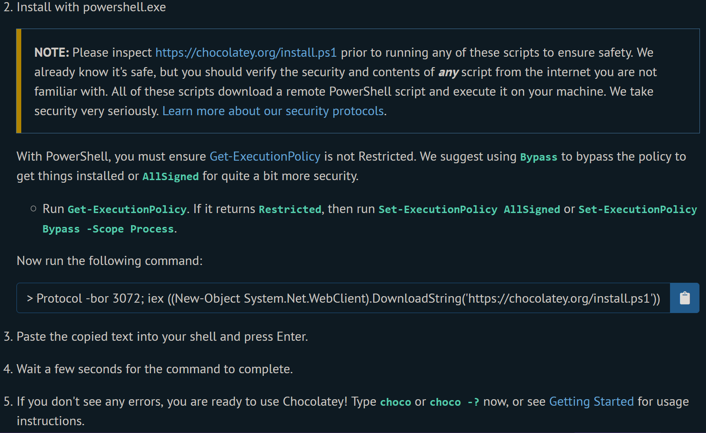
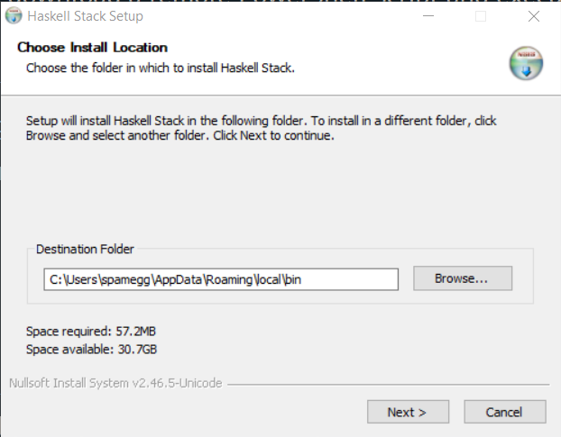
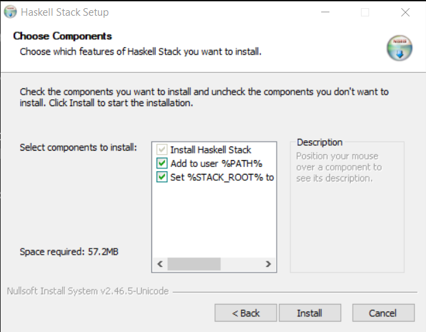
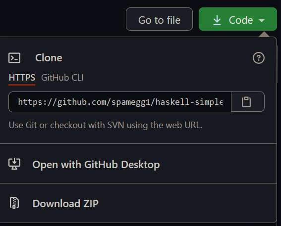
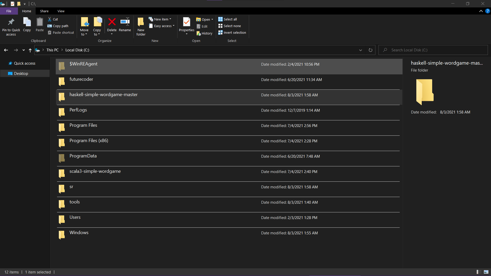
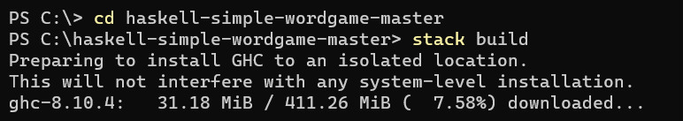

# haskell-simple-wordgame

Made with `stack new project`

Run `stack build`, `stack test` and `stack run` to play the game!

## Installation

These instructions are for Windows. Linux/Mac are similar/easier.

1. Open an Administrative Powershell window.

2. To install [Chocolatey](https://chocolatey.org/install#install-step2) run `Set-ExecutionPolicy Bypass -Scope Process -Force; [System.Net.ServicePointManager]::SecurityProtocol = [System.Net.ServicePointManager]::SecurityProtocol -bor 3072; iex ((New-Object System.Net.WebClient).DownloadString('https://chocolatey.org/install.ps1'))`.

   

3. To install Haskell, run `choco install haskell-dev` and then `refreshenv`.

4. To install `stack` download the installer [here](https://docs.haskellstack.org/en/stable/install_and_upgrade/#windows) and run it, don't change any settings.

   

   

5. Download the repository.

   

6. Extract it to `C:\haskell-simple-wordgame-master`.

   

7. In Powershell run `cd C:\haskell-simple-wordgame-master` then run `stack build`.

   

GAME IS STILL INCOMPLETE! TODO: implement `playHand` and `playGame`.
